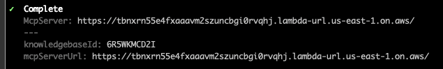
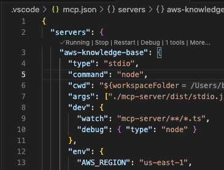

# AWS Bedrock Knowledge Base MCP Server

With compliments to the following projects and their respective authors for providing the foundational work:
https://github.com/daohoangson/aws-knowledge-base-mcp-server

https://github.com/modelcontextprotocol/servers-archived/tree/main/src/aws-kb-retrieval-server

## Overview

This solution provides Retrieval Augmented Generation (RAG) capabilities using an AWS Bedrock Knowledge Base integrated with the Model Context Protocol (MCP). This can be integrated with various MCP-compatible AI agent clients, such as VS Code and Claude desktop, to provide private or specialised knowledge bases for additional context.

It's made up of two parts:

1. ./infra: The infrastructure code that sets up the Bedrock Knowledge Base, S3 bucket, IAM roles, and OpenSearch Serverless resources. This is deployed using Pulumi and SST.
2. ./mcp-server: The MCP server code that connects to the Bedrock Knowledge Base and serves as the MCP endpoint over http. This can be run locally through STDIO or deployed as a Lambda function.

## How to use

1. Clone this repository.
2. Install dependencies for both the infra and mcp-server directories with `npm install`.
3. Configure your AWS credentials to allow Pulumi and SST to deploy resources.
4. Deploy the infrastructure using SST:
   ```bash
   npx sst deploy
   ```
5. Deploy the MCP server as a Lambda function or run it locally:

   To run it locally, you need to add it to your MCP configuration in the agent client of your choice. For example in VS Code, in the `.vscode/mcp.json` file add the following:

   ```json
   {
     "servers": {
       "<name-your-mcp-client>": {
         "type": "stdio",
         "command": "node",
         "cwd": "${workspaceFolder}",
         "args": ["./mcp-server/dist/stdio.js"],
         "dev": {
           "watch": "mcp-server/**/*.ts",
           "debug": { "type": "node" }
         },
         "env": {
           "AWS_REGION": "us-east-1",
           "AWS_BEDROCK_KNOWLEDGE_BASE_ID": "<knowledge-base-id>",
           "AWS_ACCESS_KEY_ID": "<aws-access-key-id>",
           "AWS_SECRET_ACCESS_KEY": "<aws-secret-key>",
           "AWS_SESSION_TOKEN": "<aws-session-token>"
         }
       }
     },
     "inputs": []
   }
   ```

   You can get the AWS_BEDROCK_KNOWLEDGE_BASE_ID from the SST deployment output:

   

   If you want to connect to the remotely deployed lambda MCP server, you can add it as follows:

   ```json
   {
     "servers": {
       "<name-your-mcp-client>": {
         "url": "<mcpServerUrl>",
         "type": "http"
       }
     },
     "inputs": []
   }
   ```

## Debugging MCP Server locally with VS Code

Both the local and remote (lambda) MCP servers can be debugged using VS Code. For the local server with the `debug` property set to "node", you can hover over the server details in `mcp.json` select the "debug" option:



Then it's a case of adding breakpoints and invoking MCP requests from GitHub copilot (or other clients) as normal.

## Known Limitations

- Despite using streaming, the response is not actually streamed back to the client, it is buffered and sent as a single response at the end.

## Next Steps

- Provide authentication using OAuth 2.1 for the MCP server
